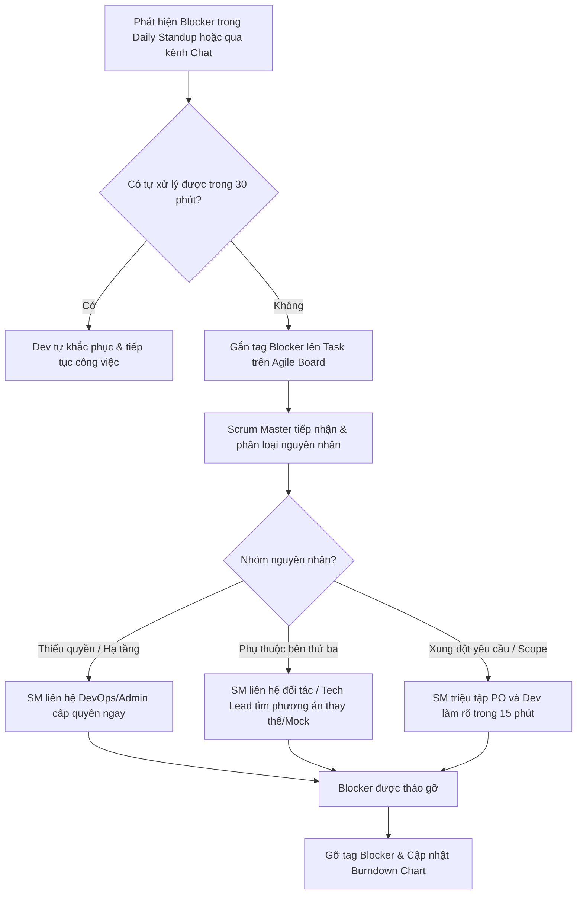

# 🛡️ Quản Trị Chướng Ngại Vật (Impediment) & Rủi Ro Phát Sinh Trong Sprint

Nhiệm vụ hàng đầu của **Scrum Master (SM)** là làm chiếc khiên chắn bảo vệ Development Team khỏi những sự xao nhãng bên ngoài, đồng thời chủ động gỡ bỏ các vật cản (Impediments / Blockers) để luồng công việc diễn ra thông suốt.

---

## 1. Phân Biệt Giữa Technical Issue & Impediment

| Loại vấn đề | Định nghĩa | Ai xử lý? |
| :--- | :--- | :--- |
| **Technical Issue (Sự cố kỹ thuật)** | Lỗi code, syntax error, logic thuật toán trong phạm vi chuyên môn của lập trình viên. | Lập trình viên tự nghiên cứu hoặc xin trợ giúp từ đồng nghiệp / Tech Lead. |
| **Impediment / Blocker (Chướng ngại vật)** | Vấn đề nằm ngoài khả năng tự quyết của cá nhân (Chưa có quyền truy cập AWS/Stripe, API của bên thứ 3 bị sập, PO thay đổi yêu cầu đột ngột, môi trường dev bị lỗi,...). | **Scrum Master có trách nhiệm trực tiếp gỡ vướng trong vòng 2 - 4 giờ.** |

---

## 2. Quy Trình Xử Lý Chướng Ngại Vật (Impediment Playbook)

---

## 3. Xử Lý Yêu Cầu Đột Xuất Phát Sinh Trong Sprint (Scope Creep)

Nếu trong giữa Sprint, Product Owner hoặc các phòng ban khác yêu cầu *"Thêm gấp tính năng này vào Sprint hiện tại"*:

### Nguyên tắc ứng xử của Scrum Master:
1. **Bảo vệ Sprint Goal**: Tuyệt đối không tự ý nhét thêm việc vào Sprint đang chạy nếu làm ảnh hưởng đến cam kết ban đầu.
2. **Nguyên tắc "Đổi 1 lấy 1" (Trade-off Principle)**:
   - Nếu tính năng mới **bắt buộc phải làm ngay**: PO và Team phải cùng ngồi lại để **loại bỏ một User Story có số Story Points tương đương** ra khỏi Sprint Backlog và đưa về Product Backlog.
   - Tổng Story Points cam kết của Sprint không được phép tăng lên.
3. **Nếu tính năng làm thay đổi toàn bộ kiến trúc hoặc mục tiêu**: Scrum Master có quyền đề xuất PO xem xét **hủy bỏ Sprint (Abnormal Sprint Termination)** để tái lập kế hoạch Sprint mới.

---

## 4. Xử Lý Sự Cố Hotfix Trên Production Khi Đang Chạy Sprint

Khi xảy ra lỗi nghiêm trọng trên Production cần kích hoạt quy trình Hotfix:
- **Tác động lên Sprint**:
  - Không kéo toàn bộ Dev Team vào làm Hotfix.
  - Tech Lead chỉ định **1 Senior Developer duy nhất** tách sang nhánh `hotfix/*` từ `prod` để xử lý theo đúng quy trình tài liệu [`DOCS/01-quy-chuan-phat-trien-git/04-quy-trinh-hotfix-khan-cap.md`](../01-quy-chuan-phat-trien-git/04-quy-trinh-hotfix-khan-cap.md).
  - Scrum Master ghi nhận số giờ tiêu tốn cho Hotfix và điều chỉnh nhẹ Velocity của Sprint.
  - Sau khi Hotfix được release lên `prod`, bắt buộc đồng bộ ngược vào `staging` và `dev`.
  - Tại buổi **Sprint Retrospective**, tổ chức phiên phân tích nguyên nhân gốc rễ (Root Cause Analysis - RCA 5 Whys) để ngăn lỗi lặp lại.
