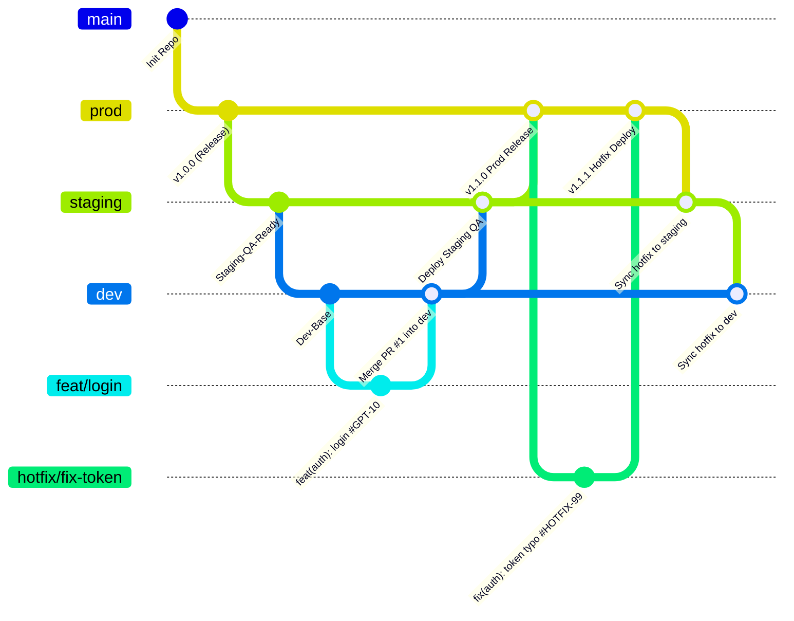

# 🌿 Chiến Lược Phân Nhánh Gitflow (Branching Strategy)

Tài liệu này quy định cấu trúc và nguyên tắc vận hành của mô hình phân nhánh Gitflow áp dụng cho dự án `gpt-images`.

---

## 1. Sơ đồ Tổng quan Mô hình Gitflow



---

## 2. Các Nhánh Chính (Main Branches)

Hệ thống duy trì **3 nhánh chính vĩnh viễn (Long-lived branches)**:

| Tên nhánh | Môi trường tương ứng | Mục đích | Chính sách bảo vệ |
| :--- | :--- | :--- | :--- |
| **`prod`** | **Production** (Người dùng cuối) | Chứa mã nguồn ổn định nhất đang chạy thực tế trên sản phẩm. Tuyệt đối không có code thử nghiệm. | **Khóa Push trực tiếp.** Chỉ nhận code qua Pull Request từ `staging` (khi release) hoặc từ `hotfix/*`. Yêu cầu ít nhất 2 Reviewers và pass toàn bộ CI checks. |
| **`staging`** | **Staging / UAT / Pre-prod** | Dùng cho đội ngũ QA/QC kiểm thử chất lượng, test tích hợp, và demo tính năng cho khách hàng/stakeholders trước khi lên Production. | **Khóa Push trực tiếp.** Nhận code qua PR/Merge từ nhánh `dev` hoặc đồng bộ sau `hotfix`. |
| **`dev`** | **Development / Dev Server** | Nhánh làm việc trung tâm của đội ngũ lập trình. Nơi tất cả tính năng mới được tích hợp kiểm tra ban đầu. | **Khóa Push trực tiếp.** Tất cả tính năng phải tạo nhánh `feat/*` riêng biệt và mở PR vào `dev`. |

---

## 3. Các Nhánh Tạm Thời (Temporary / Supporting Branches)

### 3.1. Nhánh Tính năng (`feat/*`)
- **Nhánh gốc**: Rẽ nhánh từ `dev`.
- **Định dạng tên nhánh**: `feat/<tên-tính-năng>` hoặc `feat/<issue-id>-<tên-tính-năng>`.
  - Ví dụ: `feat/homepage`, `feat/GPT-101-image-generation`, `feat/auth-google`.
- **Quy trình làm việc**:
  1. Lập trình viên kéo mã mới nhất từ `dev`: `git checkout dev && git pull origin dev`.
  2. Tạo nhánh tính năng: `git checkout -b feat/homepage`.
  3. Lập trình, commit tuân thủ Conventional Commits và có Issue ID.
  4. Push lên remote: `git push -u origin feat/homepage`.
  5. Mở Pull Request vào nhánh `dev`.
  6. Sau khi được duyệt và merge vào `dev`, nhánh `feat/homepage` sẽ được xóa để dọn dẹp repo.

---

### 3.2. Nhánh Vá lỗi khẩn cấp (`hotfix/*`)
- **Nhánh gốc**: Rẽ nhánh trực tiếp từ **`prod`**.
- **Định dạng tên nhánh**: `hotfix/<tên-lỗi>` hoặc `hotfix/<issue-id>-<tên-lỗi>`.
  - Ví dụ: `hotfix/fix-login-error`, `hotfix/HOTFIX-201-billing-crash`.
- **Mục đích**: Khắc phục các lỗi nghiêm trọng (Critical Bug, Security Vulnerability) đang xảy ra trực tiếp trên Production và cần xử lý ngay lập tức mà không chờ chu kỳ release của `dev`.
- **Quy trình làm việc**:
  1. Tạo nhánh từ `prod`: `git checkout prod && git pull origin prod && git checkout -b hotfix/fix-login-error`.
  2. Sửa lỗi, kiểm tra kỹ lưỡng, commit chuẩn: `fix(auth): fix token expiration crash #HOTFIX-201`.
  3. Mở PR vào `prod`.
  4. Sau khi duyệt và merge vào `prod`, lập tức triển khai bản vá lên Production.
  5. **BƯỚC QUAN TRỌNG NHẤT**: Merge ngược từ `prod` vào `staging` và `dev` để đảm bảo code sửa lỗi không bị mất trong các lần release sau.

---

## 4. Tóm tắt Luồng Chuyển Giao Mã Nguồn

```
[feat/xxx]  ──(PR)──>  [dev]  ──(Merge)──>  [staging]  ──(Release PR)──>  [prod]
                         ▲                     ▲                             │
                         │                     │                             ▼
                         └──────(Sync)─────────┴────────(Sync)──────── [hotfix/xxx]
```
