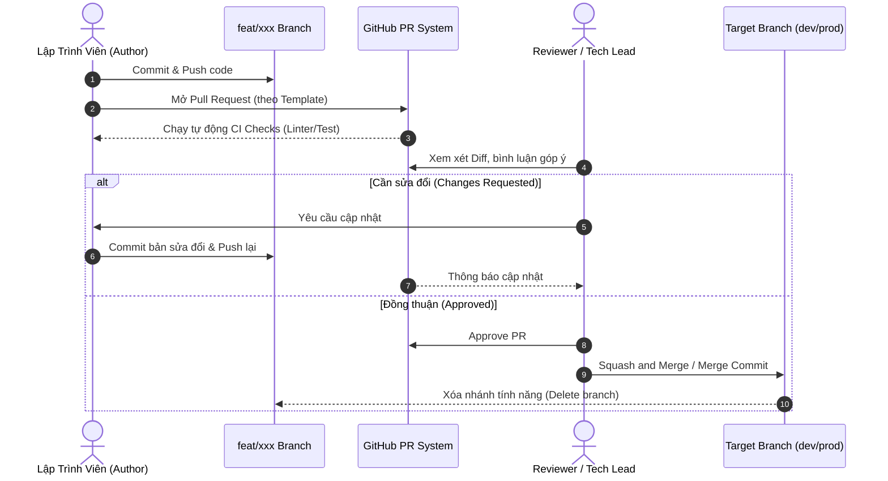

# 🔍 Quy Trình Code Review & Pull Request (PR)

Pull Request (PR) là chốt chặn quan trọng nhất để bảo đảm chất lượng mã nguồn, chia sẻ kiến thức trong team và ngăn chặn lỗi trước khi đến tay người dùng.

---

## 1. Vòng Đời của một Pull Request

---

## 2. Tiêu Chuẩn Khi Mở Pull Request (Author Checklist)

Trước khi bấm nút **Create Pull Request**, tác giả PR cần đảm bảo:
1. **Tiêu đề PR**: Bắt buộc tuân thủ Conventional Commits kèm Issue ID.
   - Ví dụ: `feat(gallery): implement infinite scroll pagination #GPT-115`
2. **Nội dung PR**: Sử dụng mẫu template `.github/pull_request_template.md`:
   - Nêu rõ vấn đề cần giải quyết.
   - Đính kèm ảnh chụp màn hình / video demo giao diện (nếu làm Frontend).
   - Đính kèm log kiểm thử thành công.
3. **Kích thước PR (PR Size)**:
   - Một PR lý tưởng không nên vượt quá **300 - 400 dòng code thay đổi**.
   - Tránh việc mở một PR khổng lồ chứa hàng nghìn dòng khiến người review quá tải.
4. **Không để conflict**: Luôn rebase hoặc merge mã mới nhất từ `dev` vào nhánh của mình trước khi mở PR.

---

## 3. Trách Nhiệm Của Reviewer (Reviewer Guidelines)

- **Tốc độ phản hồi**: Phản hồi PR trong vòng 4 - 8 giờ làm việc.
- **Thái độ xây dựng**: Nhận xét tập trung vào mã nguồn, cấu trúc giải pháp và logic nghiệp vụ, tránh công kích cá nhân.
- **Checklist kiểm tra**:
  - [ ] Logic nghiệp vụ có đáp ứng đúng yêu cầu của Issue không?
  - [ ] Có phát sinh nguy cơ bảo mật không (SQL Injection, XSS, lộ API Key)?
  - [ ] Có xử lý ngoại lệ (Try-Catch / Error Handling) đầy đủ không?
  - [ ] Code có dễ đọc, clean, tuân thủ naming convention không?
  - [ ] Có bị dư thừa file rác hoặc debug `console.log` không?

---

## 4. Quy Tắc Merge

- **Đối với nhánh `dev`**: Sử dụng chiến lược **Squash and Merge** hoặc **Rebase and Merge** để giữ lịch sử commit trên `dev` gọn gàng, rõ ràng.
- **Đối với nhánh `staging` và `prod`**: Sử dụng **Merge Commit** (`--no-ff`) để ghi nhận mốc phát hành (Release Milestone) và bảo toàn lịch sử tích hợp.
