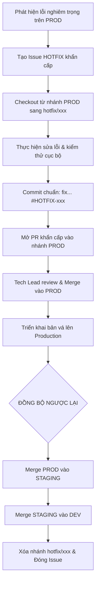

# 🚨 Quy Trình Xử Lý Sự Cố Khẩn Cấp (Hotfix Workflow)

Hotfix là quy trình đặc biệt dành riêng cho việc xử lý các lỗi nghiêm trọng (Critical / Blocker) phát sinh trực tiếp trên môi trường **Production**, đòi hỏi phải đưa bản vá lên hệ thống trong thời gian ngắn nhất mà không làm ảnh hưởng đến tiến độ phát triển các tính năng đang dang dở trên nhánh `dev`.

---

## 1. Khi Nào Kích Hoạt Quy Trình Hotfix?

Chỉ áp dụng nhánh `hotfix/*` khi thỏa mãn các điều kiện sau:
- ❌ Hệ thống Production bị sập, treo hoặc lỗi crash dịch vụ.
- ❌ Lỗi bảo mật nghiêm trọng (Rò rỉ dữ liệu, lỗ hổng quyền truy cập).
- ❌ Tính năng cốt lõi bị tê liệt (Người dùng không thể đăng nhập, không thể thanh toán, không thể tạo ảnh).

> [!WARNING]
> Những lỗi nhỏ về mặt hiển thị, lỗi không nghiêm trọng hoặc các cải tiến mới **KHÔNG ĐƯỢC** tính là Hotfix. Những thay đổi này phải đi theo quy trình thông thường: `dev` -> `staging` -> `prod`.

---

## 2. Sơ Đồ Quy Trình Hotfix



---

## 3. Các Bước Thực Hiện Chi Tiết Bằng Câu Lệnh Git

### Bước 1: Lấy mã nguồn mới nhất của `prod` và tạo nhánh Hotfix
```bash
# Đảm bảo đang ở nhánh prod và đã đồng bộ
git checkout prod
git pull origin prod

# Tạo nhánh hotfix mới
git checkout -b hotfix/fix-payment-crash
```

### Bước 2: Sửa lỗi và Commit theo chuẩn
```bash
# Kiểm tra file đã sửa
git status

# Đưa vào staging area
git add .

# Commit tuân thủ Conventional Commits và có ID issue hotfix
git commit -m "fix(billing): handle null pointer in payment webhook #HOTFIX-201"
```

### Bước 3: Push nhánh hotfix và mở PR vào `prod`
```bash
git push -u origin hotfix/fix-payment-crash
```
*Sau đó, mở PR trên giao diện GitHub từ nhánh `hotfix/fix-payment-crash` vào `prod` để Tech Lead review & merge khẩn cấp.*

### Bước 4: Đồng bộ ngược (Reverse Sync) vào `staging` và `dev`
> [!IMPORTANT]
> Đây là bước **BẮT BUỘC** để tránh tình trạng lỗi bị xuất hiện trở lại ở các bản release tiếp theo!

```bash
# 1. Đồng bộ vào staging
git checkout staging
git pull origin staging
git merge prod --no-edit
git push origin staging

# 2. Đồng bộ vào dev
git checkout dev
git pull origin dev
git merge staging --no-edit
git push origin dev
```

### Bước 5: Dọn dẹp nhánh
```bash
# Xóa nhánh hotfix cục bộ và trên remote
git branch -d hotfix/fix-payment-crash
git push origin --delete hotfix/fix-payment-crash
```
