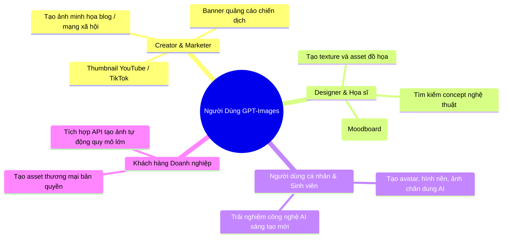

# 🎯 Tổng Quan Nghiệp Vụ Sản Phẩm GPT-Images

Dự án **GPT-Images** là nền tảng trực tuyến ứng dụng công nghệ Trí tuệ nhân tạo tạo sinh (Generative AI) tiên tiến, cho phép người dùng sáng tạo hình ảnh kỹ thuật số chất lượng cao từ các mô tả bằng văn bản tự nhiên (Text-to-Image Prompt).

---

## 1. Mục Tiêu & Tầm Nhìn Sản Phẩm

- **Đơn giản hóa sáng tạo nội dung**: Giúp các nhà sáng tạo nội dung, marketer, designer và người dùng phổ thông tạo ra hình ảnh độc đáo, đúng ý chỉ trong vài giây mà không cần kỹ năng đồ họa phức tạp.
- **Tối ưu hóa chi phí sản xuất hình ảnh**: Cung cấp giải pháp hình ảnh thương mại linh hoạt theo mô hình hạn mức tín dụng (Credits) và gói thuê bao định kỳ (Subscription).
- **Hệ sinh thái hình ảnh trực tuyến**: Kết hợp giữa công cụ tạo sinh (AI Generator) và mạng lưới thư viện chia sẻ ý tưởng (Inspiration Gallery).

---

## 2. Đối Tượng Người Dùng Mục Tiêu (User Personas)

---

## 3. Các Chỉ Số Đánh Giá Thành Công (Business KPIs)

1. **User Retention**: Tỷ lệ người dùng quay lại tạo ảnh hàng tuần (WAU / MAU >= 35%).
2. **Generation Success Rate**: Tỷ lệ tạo ảnh thành công không gặp lỗi kỹ thuật >= 99.2%.
3. **Average Generation Time**: Thời gian phản hồi tạo ảnh trung bình < 8 giây/ảnh.
4. **Credit Conversion Rate**: Tỷ lệ chuyển đổi từ gói miễn phí (Free Trial) sang gói trả phí (Paid Tier) >= 5%.
