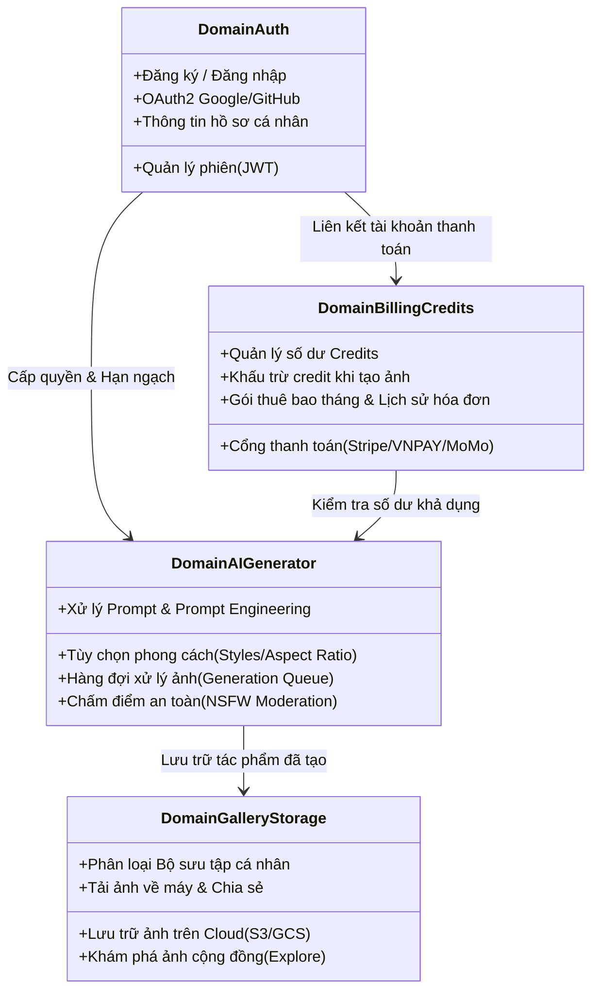

# 🧩 Phân Rã Chức Năng Theo Phân Hệ Nghiệp Vụ (Business Domains)

Để đảm bảo hệ thống có khả năng mở rộng (scalability), dễ bảo trì và phân định rõ trách nhiệm của các nhóm phát triển, nghiệp vụ của hệ thống **GPT-Images** được phân rã thành **4 Phân hệ Nghiệp vụ Cốt lõi (Core Business Domains)**.

---

## 1. Bản Đồ Phân Hệ Nghiệp Vụ

---

## 2. Chi Tiết Từng Phân Hệ Nghiệp Vụ

### 2.1. Phân Hệ Xác Thực & Tài Khoản (Authentication & Profile Domain)
- **Mục tiêu**: Định danh người dùng an toàn, bảo vệ tài nguyên và lưu trữ thông tin cá nhân.
- **Tính năng chính**:
  - Đăng ký tài khoản qua Email/Password và Social Login (Google, GitHub).
  - Đăng nhập bảo mật với JSON Web Token (Access Token & Refresh Token).
  - Quản lý hồ sơ người dùng (Ảnh đại diện, Tên hiển thị, Đổi mật khẩu).
  - Phân quyền (Roles): `User`, `Creator`, `Admin`.

---

### 2.2. Phân Hệ Trí Tuệ Nhân Tạo & Tạo Ảnh (AI Generation Engine Domain)
- **Mục tiêu**: Xử lý yêu cầu tạo ảnh từ câu lệnh văn bản của người dùng với chất lượng cao nhất.
- **Tính năng chính**:
  - **Prompt Engineering Assistant**: Gợi ý từ khóa tối ưu hóa chi tiết câu lệnh (Enhance Prompt).
  - **Cấu hình thông số tạo ảnh**:
    - Tỷ lệ khung hình (Aspect Ratio): `1:1`, `16:9`, `9:16`, `4:3`, `3:2`.
    - Phong cách nghệ thuật (Art Styles): Photorealistic, Anime, Cyberpunk, 3D Render, Oil Painting.
    - Chất lượng (Quality): Standard (1 Credit), HD/4K (2 Credits).
  - **Kiểm duyệt nội dung (Content Moderation)**: Tự động chặn các từ khóa vi phạm chính sách an toàn, bạo lực, khiêu dâm.
  - **Hàng đợi bất đồng bộ (Async Job Queue)**: Tiếp nhận tác vụ và thông báo cho giao diện khi xử lý xong (qua WebSocket hoặc Polling).

---

### 2.3. Phân Hệ Quản Lý Thư Viện & Lưu Trữ (Gallery & Asset Management Domain)
- **Mục tiêu**: Giúp người dùng tổ chức, lưu trữ và tìm lại các tác phẩm đã tạo.
- **Tính năng chính**:
  - **Personal Gallery**: Kho ảnh riêng tư của người dùng, phân theo thời gian tạo.
  - **Collections / Albums**: Tạo các thư mục dự án để nhóm các bức ảnh cùng chủ đề.
  - **Public Feed (Khám phá)**: Người dùng có thể chia sẻ tác phẩm kèm Prompt lên cộng đồng để nhận like, bookmark và truyền cảm hứng.
  - **Asset Delivery**: Xuất ảnh định dạng PNG/JPG/WebP chất lượng gốc không nén.

---

### 2.4. Phân Hệ Thanh Toán & Hạn Mức Tín Dụng (Billing & Credits Domain)
- **Mục tiêu**: Tạo dòng doanh thu và kiểm soát chi phí GPU/API thông qua cơ chế hạn mức.
- **Quy tắc tính phí (Credit Rules)**:
  - Khi đăng ký tài khoản mới: Tặng ngay **20 Credits trải nghiệm**.
  - Mỗi lần tạo ảnh Standard: Trừ **1 Credit**.
  - Tạo ảnh nâng cao (HD / Upscale): Trừ **2 Credits**.
- **Tính năng chính**:
  - Mua thêm gói Credits linh hoạt (Ví dụ: $5 = 100 Credits, $20 = 500 Credits).
  - Đăng ký gói thành viên hàng tháng (Pro Subscription - Tự động nạp Credits mỗi tháng).
  - Tích hợp cổng thanh toán an toàn (Stripe, Thẻ tín dụng quốc tế).
  - Xuất hóa đơn VAT và tra cứu lịch sử chi tiêu.
