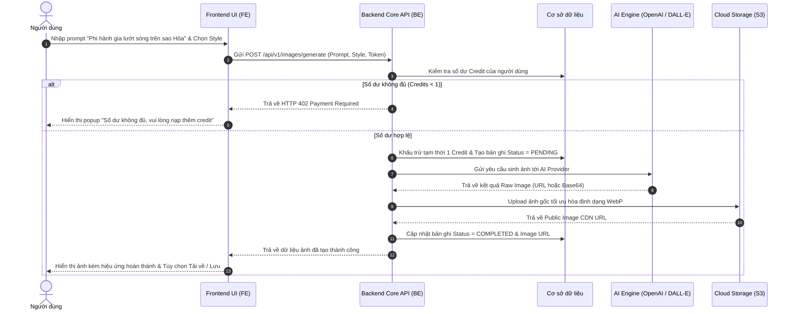
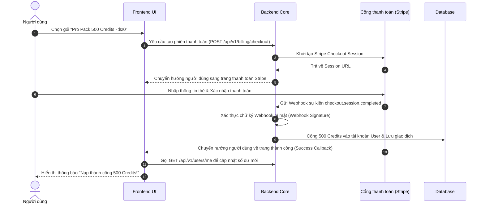

# 🔄 Luồng Nghiệp Vụ Người Dùng (Business User Flows)

Tài liệu này mô tả các luồng hành vi chính (End-to-End User Journeys) diễn ra trong nền tảng GPT-Images.

---

## 1. Luồng Nghiệp Vụ Cốt Lõi: Tạo Ảnh Từ Văn Bản (Text-to-Image Generation Flow)

---

## 2. Luồng Nghiệp Vụ Nạp Credit & Thanh Toán (Billing & Credit Top-up Flow)

