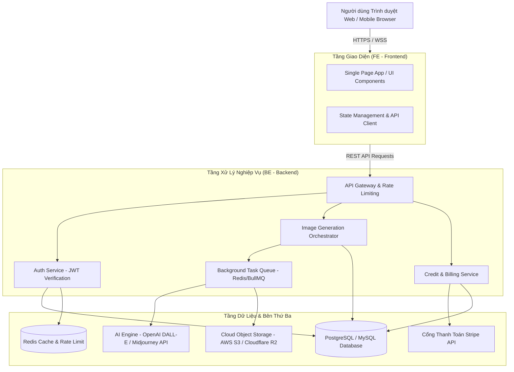

# 🏗️ Thiết Kế Kiến Trúc Tổng Thể Hệ Thống (System Architecture)

Dự án **GPT-Images** được thiết kế theo mô hình tách biệt Frontend (`FE`) và Backend (`BE`) nhằm tối đa hóa tính độc lập, khả năng mở rộng quy mô và kiểm soát hiệu năng.

---

## 1. Mô Hình Kiến Trúc 3 Tầng (3-Tier Architecture)

---

## 2. Trách Nhiệm Từng Thành Phần

### 2.1. Thư mục `FE/` (Frontend Application)
- Đảm nhận toàn bộ giao diện người dùng, responsive trên desktop và mobile.
- Render tức thì kết quả prompt, preview trạng thái chờ xử lý (Loading skeleton, progress bar).
- Quản lý phiên đăng nhập cục bộ (Access token lưu an toàn).
- Tối ưu hóa SEO và tốc độ tải trang bước đầu.

### 2.2. Thư mục `BE/` (Backend Application)
- Cung cấp toàn bộ RESTful API endpoints.
- Kiểm tra tính hợp lệ của token, xác thực quyền hạn người dùng (RBAC).
- Quản lý hạn mức và trừ số dư Credit nguyên tử (Atomic transaction) để chống race condition.
- Kết nối tới AI Providers, chuẩn hóa dữ liệu trả về và đẩy ảnh lên Cloud Object Storage.
- Xử lý Webhook an toàn từ cổng thanh toán.

### 2.3. Dịch vụ Đám mây & AI Engine
- **Cloudflare R2 / AWS S3**: Lưu trữ hình ảnh sản phẩm với chi phí băng thông tối ưu, hỗ trợ CDN phân phối toàn cầu.
- **AI Gateway / OpenAI API**: Xử lý tạo ảnh dựa trên model DALL-E 3 hoặc Stable Diffusion.
