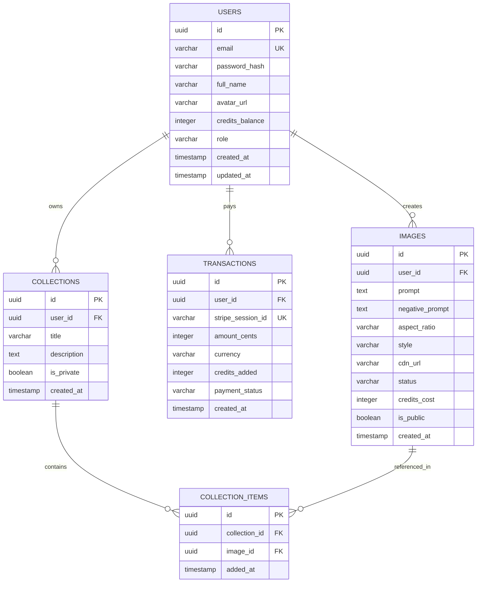

# 🗄️ Mô Hình Dữ Liệu Cơ Sở (Database Schema & Entity Relationship)

Hệ thống sử dụng cơ sở dữ liệu quan hệ (PostgreSQL) kết hợp với Redis Cache để đảm bảo tính toàn vẹn dữ liệu giao dịch tài chính (ACID) và hiệu năng truy vấn nhanh.

---

## 1. Sơ Đồ Thực Thể Quan Hệ (Entity Relationship Diagram - ERD)



---

## 2. Các Ràng Buộc Kỹ Thuật Quan Trọng

1. **Credit Atomic Update**: Khi trừ credit để tạo ảnh hoặc cộng credit sau thanh toán, bắt buộc sử dụng cơ chế khóa dòng (`SELECT ... FOR UPDATE`) hoặc câu lệnh nguyên tử:
   ```sql
   UPDATE users 
   SET credits_balance = credits_balance - 1 
   WHERE id = $1 AND credits_balance >= 1;
   ```
2. **Indexing**:
   - `users(email)`: B-Tree Unique Index.
   - `images(user_id, created_at DESC)`: Composite Index cho truy vấn phân trang ảnh của cá nhân.
   - `images(is_public, created_at DESC)`: Composite Index phục vụ trang Khám phá (Public Explore Feed).
   - `transactions(stripe_session_id)`: B-Tree Unique Index để phòng chống tấn công thanh toán trùng lặp (Idempotency).
