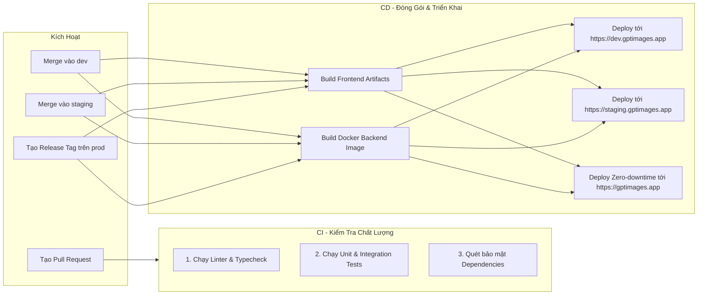

# 🚀 Quy Trình CI/CD Tự Động Hóa (Continuous Integration & Delivery)

Quy trình CI/CD đảm bảo rằng mọi đoạn mã được đẩy lên đều được kiểm tra tính đúng đắn tự động, đóng gói container và triển khai an toàn lên các môi trường tương ứng.

---

## 1. Sơ Đồ Pipeline CI/CD

---

## 2. Các Bước Kiểm Tra Chất Lượng Tự Động (CI Checks)

1. **Commit Message Linting**: Kiểm tra toàn bộ commit trong PR có tuân thủ cú pháp Conventional Commits và có Issue ID hay không.
2. **ESLint & Prettier**: Đảm bảo toàn bộ mã nguồn tuân thủ coding conventions, không dư thừa biến không dùng hoặc format sai lệch.
3. **Automated Testing Suite**:
   - Frontend: Kiểm tra render component và luồng tương tác cơ bản bằng Jest / Vitest.
   - Backend: Kiểm tra các API endpoints và luồng trừ credit bằng Supertest / PyTest.
4. **Security Vulnerability Scan**: Quét các thư viện dependencies (`npm audit` hoặc Snyk) để phát hiện lỗ hổng đã biết.

---

## 3. Chiến Lược Triển Khai (Deployment Strategy)

- **Môi trường Development & Staging**: Triển khai theo mô hình Rolling Update trên Kubernetes / Cloud container service.
- **Môi trường Production**:
  - Triển khai theo chiến lược **Blue/Green Deployment** hoặc **Canary Release** để bảo đảm người dùng không bị gián đoạn trải nghiệm (Zero Downtime).
  - Tự động Rollback phiên bản cũ trong vòng 60 giây nếu tỷ lệ lỗi HTTP 5xx vượt quá 0.5% sau khi deploy.
